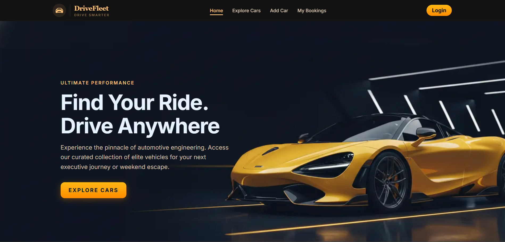

## DriveFleet — Car Rental Platform

A modern full-stack car rental web application where users can explore available cars, book vehicles, manage their bookings, and add their own car listings with secure authentication and a smooth user experience.

## Live Demo

Live Site: https://drive-fleet-client-three.vercel.app
Client Repo: https://github.com/anika-chhoa/drive-fleet.git
Server Repo: https://github.com/anika-chhoa/drive-fleet-server.git


## Project Preview




## Project Overview

DriveFleet is a full-stack car rental platform designed to simplify vehicle renting and listing. Users can browse cars, view detailed information, book vehicles, and manage their own listings through a secure authentication system using JWT and HTTP-only cookies.

The platform is fully responsive and works smoothly on mobile, tablet, and desktop devices.


## Key Features

## Car Exploration System

-Browse all available cars in a responsive grid layout
-Search cars by name using MongoDB regex filtering
-Filter cars by type (SUV, Sedan, Luxury, etc.)
-View detailed car information before booking

## Authentication System
-Email/password registration and login
-Google authentication support
-JWT-based authentication with HTTP-only cookies
-Protected routes for logged-in users

## Booking System
-Book cars with driver option and special notes
-Automatic booking date tracking
-View personal booking history
-Secure access control for user bookings

## Car Management (CRUD)
-Add new car listings (private route)
-Update existing car details
-Delete car listings with confirmation modal
-Manage “My Added Cars” dashboard

## User Dashboard
-View personal bookings
-Manage added cars
-Profile-based access control

## UI/UX Features
-Fully responsive modern UI
-Loading spinner during data fetch
-Custom 404 Not Found page
-Toast/inline error handling

## Technologies Used
-Next.js (App Router)
-React
-Node.js
-Express.js
-MongoDB
-JWT Authentication
-Tailwind CSS
-DaisyUI
-Framer Motion
-React Icons
-Lucid-icon
-React Hot Toast

## Dependencies
-next
-react
-react-dom
-express
-mongodb
-jsonwebtoken
-cookie-parser
-cors
-tailwindcss
-daisyui
-framer-motion
-react-icons
-react-hot-toast

## Installation & Setup
1. Clone the repository
```
git clone https://github.com/anika-chhoa/drive-fleet.git
```
2. Move to project directory
```
cd drivefleet-client
```
3. Install dependencies
```
npm install
```
4. Run development server
```npm run dev
```

## Environment Variables
-Client (.env.local)
-NEXT_PUBLIC_API_URL=your_backend_api_url
-Server (.env)
-PORT
-MONGO_URI=your_mongodb_connection_string
-JWT_SECRET=your_secret_key

## Learning Outcomes
-Full-stack MERN architecture implementation
-JWT authentication with HTTP-only cookies
-Protected route handling
-MongoDB CRUD operations
-Search & filter using database queries
-Real-world booking system design
-Responsive UI development

## Author
## ANIKA MIZAN
Frontend & Full-Stack Developer | MERN Stack Enthusiast | Next.js Learner